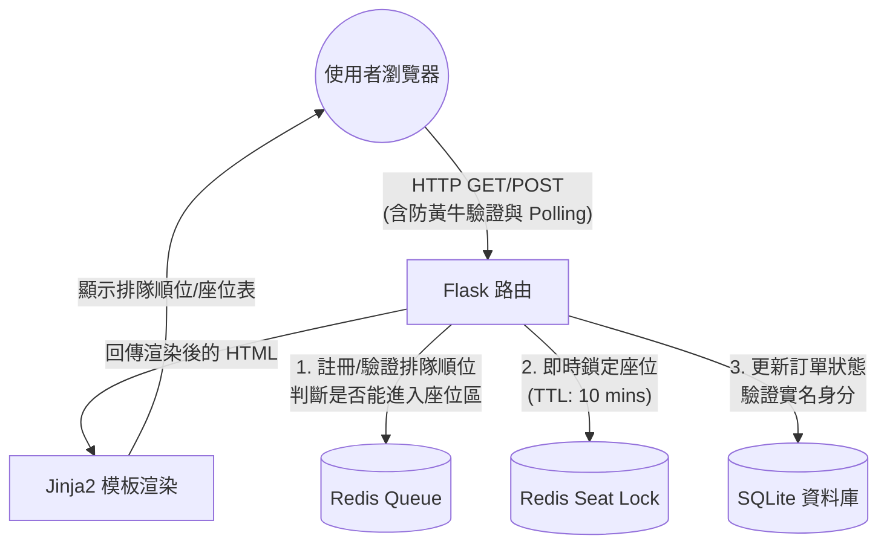

# 系統架構設計文件 (Architecture)

基於 [PRD 需求文件](./PRD.md) 的產品功能與技術指標要求，本文件定義了「演唱會搶票系統」技術架構、資料夾結構與核心元件關係。

## 1. 技術架構說明

儘管本專案採用 Flask + SQLite 的輕量架構，為了符合 PRD 所提的「高併發處理 （500,000 TPS）、防黃牛、即時選位與超時處理」等嚴苛情境，我們在架構中引進了 **Redis** 作為記憶體快取與佇列層，以降低資料庫負載。

*   **後端框架**: Python + Flask
*   **頁面渲染 (View)**: Jinja2 模板引擎與少量原生 JavaScript（用於非同步更新）。本專案為減少複雜度，未完全採前後端分離，頁面由 Flask 直接渲染，僅在等候室 polling 與座位鎖定使用 AJAX。
*   **資料庫 (長期持久化)**: SQLite (透過 SQLAlchemy ORM)。負責儲存使用者帳號、實名資料、音樂會場次設定與已結帳完成的訂單。
*   **高效能暫存與隊列 (Memory Cache & Queue)**: Redis。負責處理最消耗系統資源的「虛擬等候室排隊」以及「10 分鐘座位分散式鎖 (Distributed Lock)」。
*   **MVC 架構應用**:
    *   **Model**: 封裝 SQLite 與 Redis 的資料存取邏輯。
    *   **View**: `templates/` 目錄下的 HTML 頁面，負責將資料視覺化傳遞給終端樂迷。
    *   **Controller**: `routes/` 目錄下的 Blueprint，負責處理身分驗證、分流排隊、鎖定座位等業務邏輯。

---

## 2. 專案資料夾結構

專案以功能和模組作為劃分，確保每個檔案職責分明：

```text
app/
  __init__.py          ← Flask 應用程式工廠與套件初始化 (Redis, SQLAlchemy)
  models/              ← Model 儲存邏輯
    user_model.py      ← 使用者與實名制資料庫模型
    event_model.py     ← 演唱會與座位基礎資料模型
    order_model.py     ← 訂單資料夾與狀態模型
  routes/              ← Controller 路由模組 (Flask Blueprints)
    auth.py            ← 處理登入、實名驗證、簡訊驗證
    queue.py           ← 處理防黃牛機制與虛擬等候室分流
    ticketing.py       ← 處理選位、即時鎖定防重號 (Double Booking)
    payment.py         ← 處理結帳流程與超時釋票機制
  services/            ← 高併發商業邏輯模組
    redis_service.py   ← 處理等候室進出隊列演算法以及分散式鎖
  templates/           ← View Jinja2 HTML 樣板
    base.html          ← 網站共用 Layout (選單、Footer)
    index.html         ← 首頁 (熱門演唱會清單)
    waiting_room.html  ← 虛擬等候室頁面
    seat_selection.html← 可視化座位點選地圖
    checkout.html      ← 訂單確認與金流支付頁面
  static/              ← 前端靜態資源
    css/style.css      ← 網站樣式 (加入排隊與座位的動態狀態樣式)
    js/queue.js        ← 處理等候室的倒數計時與順序 Polling
    js/seat.js         ← 處理座位的即時選取反饋與自動釋放
instance/
  database.db          ← SQLite 實體資料庫檔案
config.py              ← 專案設定檔 (資料庫連線字串、鍵值設定)
app.py                 ← 程式執行入口
requirements.txt       ← Python 套件依賴清單
```

---

## 3. 元件關係圖

以下流程圖說明當一個樂迷點擊搶票後，不同技術元件的協同合作方式：



---

## 4. 關鍵設計決策

1.  **混合資料存儲 (Database Mixed Strategy)**
    *   **決策**：棄用純 SQLite 面對搶票情境，結合 Redis 作為主防線。
    *   **原因**：SQLite 在應對 PRD 要求中 500k TPS 會產生嚴重的 Database Lock 問題導致崩潰。透過把最龐大的「排隊狀態確認」和「座位即時搶奪鎖定」丟給 Redis 甚至擋在 Web Server 層，能夠有效確保核心系統不崩潰。
2.  **前端 Polling 輪詢替代 WebSocket 通訊**
    *   **決策**：虛擬等候室 (`waiting_room.html`) 採用 JavaScript 設定計時器（`setInterval`），每 3-5 秒向後端發送一次 HTTP GET 請求查詢自己是否排到。
    *   **原因**：對於 50 萬人的虛擬等候室，維持等量的 WebSocket 持續連線對伺服器記憶體開銷十分巨大，而無狀態的 HTTP Polling 在這種高併發場景下反而更易於用 CDN / Load Balancer 進行水平擴展。
3.  **依賴 Redis TTL (Time-To-Live) 實現超時釋票**
    *   **決策**：在選取位子時，會在 Redis 寫入一組帶有 `EX 600` (10 分鐘過期) 參數的 Key-Value Pair 作為鎖定。
    *   **原因**：如此一來不用撰寫複雜的背景定時清掃任務 (CRON job)，如果用戶十分鐘內未結帳完成，Redis 會自動刪除對該座位的鎖，其他用戶在畫面重新整理時立刻可以看見該座位並重新選取。
4.  **AI 防黃牛與 CAPTCHA 解耦**
    *   **決策**：防黃牛問答題與圖形驗證放置在進入等候室「之前」或進入「選位畫面之前」的中繼頁面。
    *   **原因**：將產生驗證圖片、計算運算的消耗完全從核心搶票 API 中抽離出來，避免腳本因為惡意請求驗證區塊而拖垮了實際處理訂單的伺服器效能。
