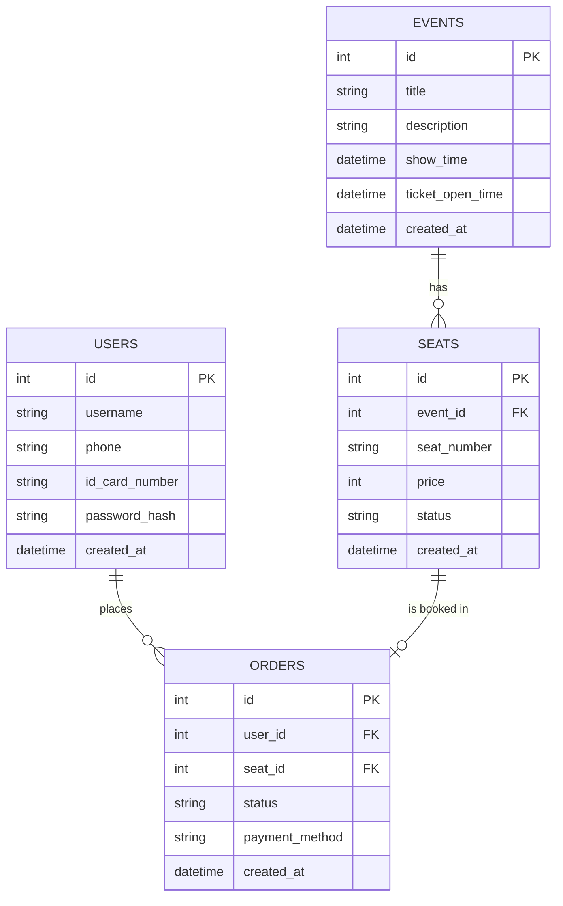

# 資料庫設計文件 (DB Design)

基於專案的需求文件 (PRD) 與架構文件 (Architecture)，本文件定義了「演唱會搶票系統」在 SQLite 中的長期持久化資料表結構與關聯。

## 1. ER 圖 (實體關係圖)

## 2. 資料表詳細說明

### `users` (使用者與實名資料表)
存放使用者帳號、實名制證件與綁定手機，防止黃牛註冊多重帳號。
- `id`: INTEGER，Primary Key，自動遞增。
- `username`: TEXT，必填，使用者暱稱或真實姓名。
- `phone`: TEXT，必填，唯一值，用於手機驗證登入。
- `id_card_number`: TEXT，必填，唯一值，用於實名制購票限制。
- `password_hash`: TEXT，必填，密碼的 Hash 值。
- `created_at`: DATETIME，帳號建立時間。

### `events` (演唱會場次表)
存放演唱會的基本資訊與開賣時間設定。
- `id`: INTEGER，Primary Key，自動遞增。
- `title`: TEXT，必填，演唱會名稱。
- `description`: TEXT，非必填，活動描述。
- `show_time`: DATETIME，必填，演出時間。
- `ticket_open_time`: DATETIME，必填，開始搶票的時間。
- `created_at`: DATETIME，資料建立時間。

### `seats` (演唱會座位表)
存放每個演唱會的所有座位，並記錄其價格與售出狀態。（臨時鎖定狀態由 Redis 處理，此表只記錄長期確定售出的狀態）
- `id`: INTEGER，Primary Key，自動遞增。
- `event_id`: INTEGER，必填，對應 `events.id` (Foreign Key)。
- `seat_number`: TEXT，必填，座位代號 (例: A-1, B-12)，同一個 event 內需避免重複。
- `price`: INTEGER，必填，該座位的定價。
- `status`: TEXT，必填，座位狀態 (`AVAILABLE` 或 `SOLD`)，預設為 `AVAILABLE`。
- `created_at`: DATETIME，資料建立時間。

### `orders` (訂單資料表)
存放結帳完成或結帳進行中的關聯記錄，對應使用者與座位。
- `id`: INTEGER，Primary Key，自動遞增。
- `user_id`: INTEGER，必填，對應 `users.id` (Foreign Key)。
- `seat_id`: INTEGER，必填，對應 `seats.id` (Foreign Key)。
- `status`: TEXT，必填，訂單狀態 (`PENDING`, `PAID`, `CANCELLED`)。
- `payment_method`: TEXT，非必填，付款方式 (例: CREDIT_CARD, LINE_PAY)。
- `created_at`: DATETIME，訂單建立時間。
