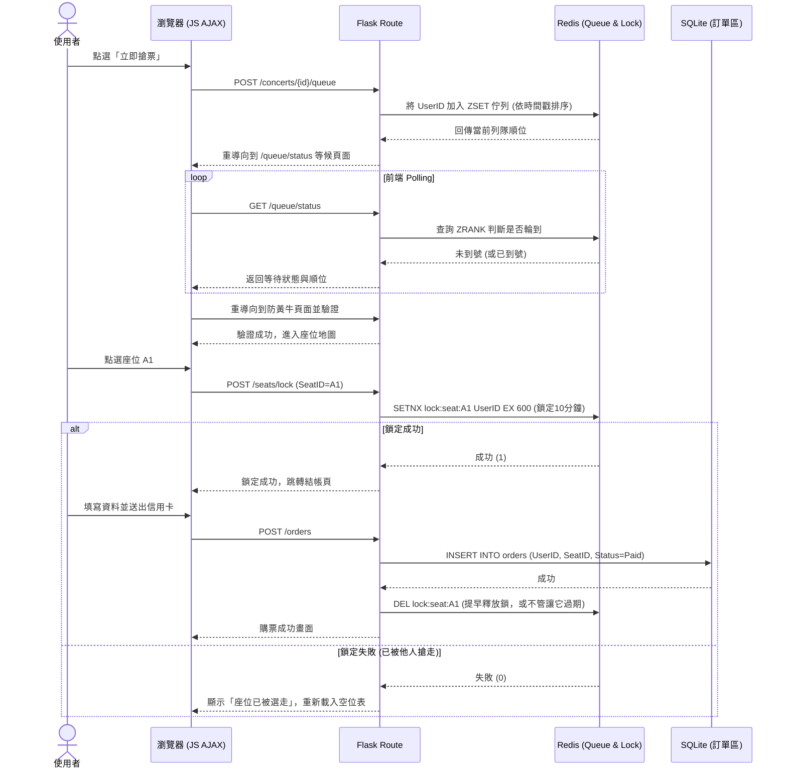

# 系統流程與功能對照表 (Flowchart)

這份文件基於 PRD 與系統架構的設計，具象化地描繪了樂迷從進入網站到完成購票的「使用者流程」，以及核心搶票與結帳動作背後的「系統序列圖」。

## 1. 使用者流程圖 (User Flow)

這張圖展示了樂迷在搶票情境中的標準操作路徑與可能的分支：

```mermaid
flowchart LR
    A([使用者造訪首頁]) --> B{是否已登入且實名驗證?}
    B -->|否| C[登入/註冊]
    C --> D[手機與實名證件驗證]
    D --> E[瀏覽演唱會場次]
    B -->|是| E
    
    E --> F{是否到達開賣時間?}
    F -->|否| G[加入收藏 / 等待]
    F -->|是| H[點擊「立即搶票」]
    
    H --> I[進入虛擬等候室]
    I --> J{是否排到號碼?}
    J -->|否| I
    J -->|是| K[防黃牛驗證 (圖形/問答)]
    
    K --> L{驗證正確?}
    L -->|否| K
    L -->|是| M[顯示座位地圖]
    
    M --> N[點選空位]
    N --> O{座位鎖定成功?}
    O -->|否, 已被搶走| M
    O -->|是| P[進入結帳流程 (保留10分鐘)]
    
    P --> Q[選擇付款方式並結帳]
    Q --> R{是否在 10 分鐘內付款?}
    R -->|是| S([購票成功，產生訂單])
    R -->|否, 超時| T([座位自動釋出回市場])
    T -.-> M
```

---

## 2. 系統序列圖 (Sequence Diagram)

這裡我們針對最關鍵的「**高併發搶票與鎖定座位**」流程，繪製出前端瀏覽器、Flask 伺服器、Redis（處理等候與鎖定）以及 SQLite（訂單儲存）的系統互動時序：



---

## 3. 功能清單與 API 對照表

以下為系統中預計實作的 Flask 路由、HTTP 方法及對應的功能描述：

| 功能群組 | HTTP 方法 | URL 路徑 | 功能說明 |
| :--- | :--- | :--- | :--- |
| **會員與認證** | `GET` | `/login` | 顯示登入與註冊頁面 |
| | `POST` | `/login` | 處理使用者登入邏輯 |
| | `GET` | `/verify` | 顯示實名制與手機驗證頁面 |
| | `POST` | `/verify` | 提交實名驗證資料（防黃牛第一道防線） |
| **演唱會瀏覽** | `GET` | `/` | 網站首頁（顯示即將開賣的演唱會） |
| | `GET` | `/concerts/<id>` | 演唱會詳細資訊（時間、地點、票價） |
| **搶票與等候室**| `POST` | `/<id>/queue/join`| 點擊搶票，將使用者發送進 Redis 排隊隊列 |
| | `GET` | `/queue/status` | AJAX polling 查詢當前排隊順位 |
| | `GET` | `/captcha` | 當排到號碼時，顯示驗證碼/防黃牛題目頁面 |
| | `POST`| `/captcha/verify` | 驗證防黃牛題目是否正確 |
| **即時選位** | `GET` | `/<id>/seats` | 顯示剩餘可選的視覺化座位表 |
| | `POST` | `/<id>/seats/lock`| 點選座位，嘗試在 Redis 設定 10 分鐘的不可更動鎖定 |
| **結帳與訂單** | `GET` | `/checkout` | 顯示填寫收件資訊與付款方式頁面 |
| | `POST` | `/orders` | 創建最終訂單，寫入 SQLite，處理結帳邏輯 |
| | `GET` | `/orders/<order_id>`| 查詢歷史訂單與票券狀態 |
